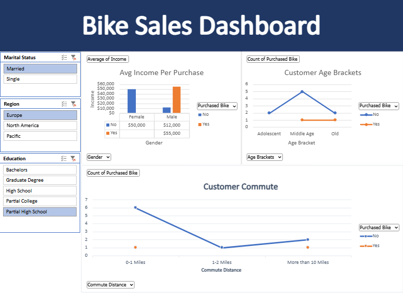

🚴‍♂️ **Bike Sales Dashboard**

An interactive Excel dashboard exploring customer demographics and bike purchasing behavior. Built using PivotCharts, slicers, and survey data to analyze income, age, commute distance, and regional trends.

**Download:** [Bike_Sales_Dataset_Dashboard.xlsx](dataset/Bike_Sales_Dataset_Dashboard.xlsx)  
**View Online:** [Open in Excel Online](https://utoronto-my.sharepoint.com/:x:/r/personal/michelle_fang_mail_utoronto_ca/_layouts/15/Doc.aspx?sourcedoc=%7B76BE3819-467E-4407-B9AE-9FF00731BC42%7D&file=Excel%20Project%20Dataset.xlsx&action=default&mobileredirect=true)

---

### Dataset

This dashboard uses a fictional customer survey dataset containing demographic details, income, commute distance, education levels, and bike purchasing status.  
The data was cleaned and structured for analysis using Excel pivot tables.

---

### Dashboard Interactivity

- **Marital Status filter** → compare purchases between married and single customers  
- **Region filter** → segment buyers across Europe, North America, and Pacific  
- **Education Level filter** → analyze purchase patterns by highest education completed  
- **Gender selector** → switch income and purchase visuals by male/female  
- **Age Bracket filter** → view purchase counts across age groups  
- **Commute Distance filter** → track purchase behavior based on travel distance  
- **Purchased Bike toggle (Yes/No)** → isolate buyers vs non-buyers across all charts  

---

### Features & Visuals

- Average income per purchase by gender  
- Purchase count by age bracket  
- Commute distance vs bike purchases  
- Excel dashboard built with PivotCharts + slicers for real-time filtering  

---

### Tools

- Microsoft Excel  
  - PivotTables  
  - PivotCharts  
  - Slicers  
  - Data cleaning and formatting

---

### Dashboard Preview

  

